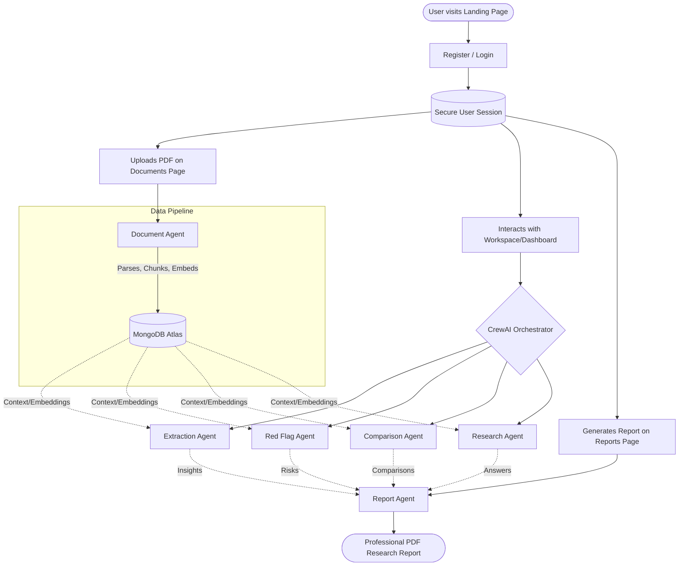

# Infosys Financial AI - User Workflow

This document outlines the typical user workflow in the **Infosys Financial AI** platform, mapping the user's actions in the frontend to the underlying AI multi-agent architecture.

## Workflow Diagram

## Detailed Breakdown

### 1. Onboarding & Authentication
- **User Action:** A user visits the **Landing** page, and then proceeds to **Register** or **Login** to their account.
- **What happens:** This creates a secure, persistent session where all their research, documents, and workspaces are saved.

### 2. Document Upload & Processing
- **User Action:** The user navigates to the **Documents** page to upload lengthy financial documents, such as 10-K filings or Annual Reports (PDFs).
- **Backend AI Action (`Document Agent`):** Once uploaded, the **Document Agent** takes over in the background. It automatically parses the PDF, chunks the text and tables, generates vector embeddings (using OpenAI), and stores them directly into MongoDB Atlas. This prepares the document for fast, contextual retrieval by the other agents without overloading their context windows.

### 3. Analysis & Workspace Interaction
- **User Action:** The user goes to their **Workspace** or **Dashboard** to start analyzing the uploaded documents. They might click to extract insights, check for risks, or ask specific financial questions.
- **Backend AI Actions:** Depending on what the user wants to see, CrewAI orchestrates several specialized agents:
  - **`Extraction Agent`:** Scans the vectorized document chunks to pull out precise financial figures, calculate ratios, and analyze revenue/profit metrics.
  - **`Red Flag Agent`:** Analyzes the data to automatically identify debt concerns, margin anomalies, and other financial risks.
  - **`Comparison Agent`:** If multiple companies/documents are involved, this agent benchmarks performance and conducts cross-company peer comparisons.
  - **`Research Agent`:** If the user asks a specific custom query (Conversational Research), this agent performs multi-step reasoning to answer complex financial questions with source-backed references from the text.

### 4. Automated Reporting
- **User Action:** Once the user is satisfied with the analysis, they can navigate to the **Reports** page to generate a cohesive summary of their findings.
- **Backend AI Action (`Report Agent`):** The **Report Agent** kicks in to compile all the insights from the previous agents (executive summary, key financials, red flags, and comparisons) into a professional, analyst-style PDF research report that the user can download.
